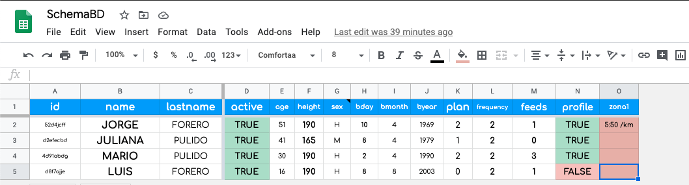
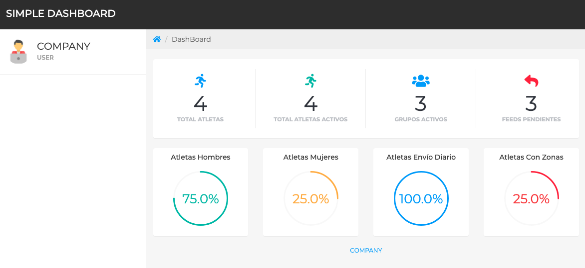

# GAS-SimpleDashBoard

Displays data from a Spreadsheet on a DashBoard using Bootstrap. This is a Google Script Webapp.

IMPORTANT:

1- This is a small part from a bigger project. It was extracted to ilustrate the way to get data from a Spreadsheet and display it using a Google Script Webapp.

2- Replace the values XXX-ID-XXX on code.gs and XXX-PATH-XXX on tpl_cp.html.

3- Some comments, on the code, are in Spanish - Maybe it's time to learn/practice Spanish :-) 

4- These are the columns of SchemaDB Spreadsheet:

This is the result of the webapp:

